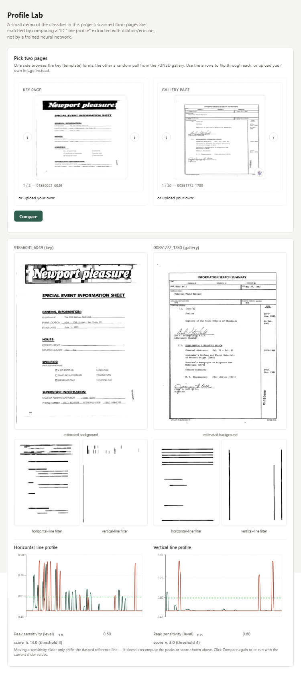

# Profile Lab (web demo)



An interactive demo: pick two pages — from the enrolled keys, a
gallery of sample pages, or your own upload — and compare their line
profiles side by side.

- `backend/` — FastAPI app, also a usable REST API on its own.
- `frontend/` — React app. Build it once (see below); the backend then
  serves the built files automatically.

## Run it

```bash
cd presentation/webapp/frontend
npm install
npm run build
cd ..
pip install -r backend/requirements.txt
uvicorn backend.main:app --reload --port 8000
```

Then open http://localhost:8000.
